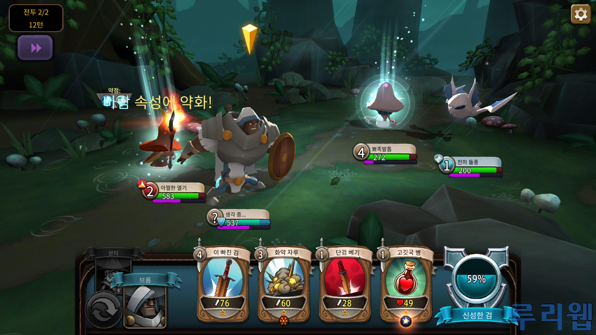

# 프로젝트명 : 던전라이크  
# [컨셉]  
## 1. 메인컨셉 :  성취감  
##  ● 유저가 던전을 클리어하면서 성취감을 느끼게 게임을 진행  
##  ● 턴제로 게임을 진행하여 전략적인 행동을 할 수 있게 여러 상호작용을 제작
##  ● 게임 난이도가 낮으면 성취감을 느끼기 힘들어 난이도 상향 
##  ● 장르 : 턴제, 로그라이크, 전략
## 2. 서브컨셉 ⑴ : 속성  
##  ● 아이템 및 Enemy에게 속성을 부여하여 상성을 부여한다
##  ● 상성에 따른 버프와 디버프를 주는 특성을 부여한다

  

# [관련 이미지 & 동영상]  
#  ● 
