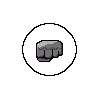

# 프로젝트명 : 리듬파이터  

 

# [ 목차 ]  
### 1. 게임명 : 리듬파이터(개발자 : 김현우)
### 2. [컨셉](#1)
### 3. [모티브](#2)
### 4. [대표 이미지](#3)
### 5. [컨셉 and 대표이미지 기반 작품묘사](#4)
### 6. [리듬파이터 구성요소](#5)
### 7. [게임시스템디자인](#6)  
####   a. [게임오브젝트 분해](#61)  
####   b. [게임의 규칙](#66)   

 

# [컨셉]  
## 1. 메인컨셉 : 리듬게임    
● 리듬감에 초점을 두고 만듬    
● 생성되는 노트들을 제거하는 순간과 게임속 음악의 박자가 맞아 플레이어에게 리듬감을 주게됨
## 2. 서브컨셉 ⑴ : 격투게임    
● 게임내 배경및 오브젝트를 격투게임처럼 만듬   
● 기존의 리듬게임과는 다르게 리듬게임을 하면서 격투게임을 하는것 처럼 게임을 만듬  
## 3. 서브컨셉 ⑵ : 도전
● 게임을 클리어 하더라도 별개의 성취 시스템을 부여함  
● 게임속 최고콤보 갯수 클리어 시간등을 판별해서 별을 부여함

  

# [모티브 이미지]  
#  ●    
#  ● 
   

# [대표이미지]   
#  ● 

 

# [컨셉 and 대표이미지 기반 작품묘사] 

# [리듬파이터 구성요소] 

## 1.메커니즘
[작동 방법]
1. 음악에 맞춰 생성되는 노트를 hitbox와 일치될때 키코드를 입력해서 노트를 삭제한다
2. 노트가 삭제될때 노트와 hitbox의 거리에 따라 점수를 부여한다
3. 부여된 점수로 Enemy에게 피해를 입힌다
4. Enemy의 HP가 0와 같거나 낮아지면 게임이 끝난다.
5. 게임이 끝나면 플레이하는동안 기록된 데이터를 토대로 점수가 부여된다

[재미 요소]
1. 리듬감
2. 팡팡튀는 이펙트
3. 도전욕구

## 2. 이야기
[만들게 된 배경]
격투게임의 콤보기술이나 상대방의 공격을 막는 방법이 리듬게임의 타이밍을 맞춰 노트를 제거하는 부분과 비슷하다고 생각하여  
리듬게임에 격투게임의 요소를 넣으면 좋을 것 같다고 생각하여 만들게 되었습니다.

## 3. 미적 요소

[디자인][컬러]  

어릴적 오락실에서 친구들과 하던 격투게임의 느낌을 살리고 싶어 픽셀그래픽으로 전체적인 게임 디자인을 하였고  
한국적인 요소를 넣고 싶어 태권도를 주인공으로 두고 적들을 다른 나라의 전통 무술이나 스포츠로 디자인 하였습니다.  
맵또한 나라별로 특색있게 제작 하였습니다.

[음향]

리듬게임이다 보니 메인 음악에 가장 많은 비중을 두고  
게임 플레이에 있어 자잘한 효과음이 많으면 게임에 집중도가 떨어진다고 생각하여 효과음을 최대한으로 줄였습니다.

 

# [게임 시스템 디자인] 
- - -

## 1. 게임 오브젝트 분해 (구성 요소 분석) 

|연번|오브젝트 이름|오브젝트 이미지|
|:----:|:----:|:----:|
|1|주인공||
|2|가라테 선수||
|3|복싱 선수||
|4|UFC 선수||
|5|노트1||
|6|노트2||
|7|노트3||
|8|노트4||
|9|히트박스||
|10|체력바||
|11|맵1||
|12|맵2||
|13|맵3||

 

## 2. 게임의 규칙 

### [핵심 규칙]
1.플레이어는 생성된 노트가 hitbox와 겹쳐질때 QWER중 하나의 버튼을 누른다.  
2.플레이어가 QWER중 하나의 버튼을 눌렀을때 노트와 Hitbox의 거리를 비교해서 점수를 차등 지급한다.  
3.점수를 지급하는 거리의 기준은 "perfect,good,bad"세가지로 나뉘어진다.  
4."perfect,good" 이 두개의 판정을 받게 된다면 콤보가 쌓이고 만약"bad"판정을 받게되면 기존의 콤보가 초기화 된다.  
5. 판정 받은 점수를 통해 적의 피를 깎고 적의 피가0이 되면 게임을 클리어하게된다.   
6. 게임이 클리어될때 3가지의 데이터를 저장하는데 각 클리어 여부, 클리어 시간, 최대콤보갯수이다.
7. 저장된 데이터값에 따라 별을 지급해준다.

  

 

